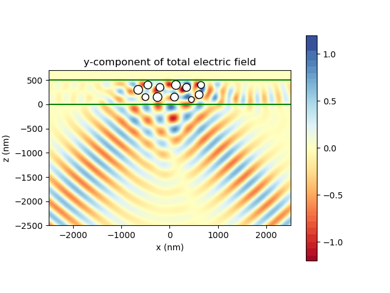
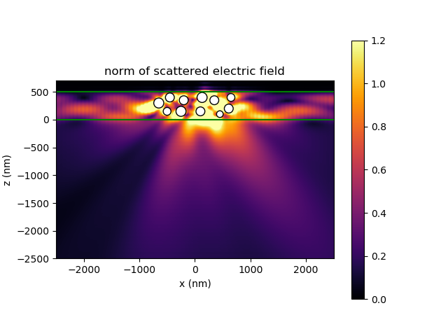

About Smuthi
===============

Smuthi stands for 'scattering by multiple particles in thin-film systems'.
The software allows you to solve light scattering problems involving
one ore multiple particles near or inside a system of planar layer interfaces.
It is based on the T-matrix method for the single particle scattering,
and on the scattering-matrix method for the propagation through the layered medium.

.. image:: images/drawing.png
   :scale: 40%
   :align: center

The software solves Maxwell's equations (3D wave optics) in frequency domain (one wavelength per simulation).
An arbitrary number of spheres, spheroids and finite cylinders inside an arbitrary system of plane parallel layers can
be modelled. For spheres, the T-matrix is given by the Mie-coefficients. For spheroids and finite cylinders, Smuthi
calls the
`NFM-DS <https://scattport.org/index.php/programs-menu/t-matrix-codes-menu/239-nfm-ds>`_,
to compute the single particle T-matrix. This is a Fortran software package written by A. Doicu, T. Wriedt and Y. Eremin, based on the "Null-field method with
discrete sources".

As the initial excitation, Smuthi supports plane waves, Gaussian beams and single or multiple point dipole sources.

You can compute the 3D electric near field along a cut plane and save it in the form of ascii data files,
png images or animations. The dashed circles around the particles are a reminder that inside the circumscribing sphere
of the particles, the computed near fields cannot be trusted.

.. image:: images/norm_E.png
   :scale: 52 %

.. image:: images/E_y.gif
   :scale: 52 %

In the above example, the initial field is given by a
plane wave incident from below.

.. image:: images/norm_E_scat_gauss.png
   :scale: 52 %

The above images show an oblique Gaussian beam hitting a layer with particles under a reflective metal layer. The left
image shows the norm of the scattered field, whereas the right image shows an animation of the y-component of the total
field. One can see how the scattering couples some of the light into waveguide modes.

.. image:: images/E_y_dipole.gif
   :scale: 52 %

These images show the field from a dipole source between a collection of scattering particles. Again, the left shows the
norm of the scattered field, whereas the right shows an animation of the y-component of the total field.

Far fields
-----------

In addition, the far field power flux can be evaluated.

- For Gaussian beams, the far field power can be related to the initial field power to evaluate reflection or
  transmission figures versus absorption and incoupling into waveguide modes.
- For dipole sources,  the outcoupling efficiency can be
  studied.
- For plane wave incidence, the far field is normalized by the incoming wave's intensity to yield the
  `differential cross section <https://en.wikipedia.org/wiki/Cross_section_(physics)#Differential_cross_section>`_.

.. image:: images/bottom_dcs.png
   :scale: 52 %

.. image:: images/bottom_polar_dcs.png
   :scale: 52 %

The above images show the 2D differential cross section in the bottom layer of the same simulation to which also the
first near field images above belong. The cross section is displayed as a polar plot (left) and its azimuthal integral
as a function of the polar angle only (right),

.. math:: \mathrm{DCS}_\mathrm{polar}(\beta) = \int \mathrm{d} \alpha \, \sin\beta \, \mathrm{DCS}(\beta, \alpha)

where :math:`(\alpha,\beta)` are the azimuthal and polar angle, respectively.

The sharp feature around 40° in the example relates to total internal reflection at the interface between media 2 and 3.

Further, Smuthi also returns the extinction cross sections for the reflected and the transmitted wave. For the
scattering of a plane wave by particles in a homogeneous medium, the extinction cross section is usually defined as the
sum of total scattering and absorption cross section.

In Smuthi, we instead use what is usually referred to as the
`optical theorem <https://en.wikipedia.org/wiki/Optical_theorem>`_ to define extinction. That means, the extinction
cross section for reflection (transmission) refers to the destructive interference of the scattered signal with the
specular reflection (transmission) of the initial wave. It thereby includes absorption in the particles, scattering,
and a modified absorption by the layer system, e.g. through incoupling into waveguide modes. If the particles lead to,
say, a higher reflection than the bare layer system without particles, the extinction can also be negative.

**Acknowledgments and contact information**

Smuthi is maintained by `Amos Egel <https://www.lti.kit.edu/mitarbeiter_5812.php>`_. Please contact me for questions,
feature requests or if you would like to contribute.

The software is licensed under the `MIT license <https://en.wikipedia.org/wiki/MIT_License>`_ and includes contributions
from the following persons:

   - Adrian Doicu, Thomas Wriedt and Yuri Eremin through the
     `NFM-DS <https://scattport.org/index.php/programs-menu/t-matrix-codes-menu/239-nfm-ds>`_ package, a copy of which
     is distributed with Smuthi

The creation of Smuthi was funded by the `DFG <http://www.dfg.de/>`_ through the research project
`LAMBDA <http://gepris.dfg.de/gepris/projekt/278746617>`_ within the priority programme
`tailored disorder <http://gepris.dfg.de/gepris/projekt/255652081>`_.

