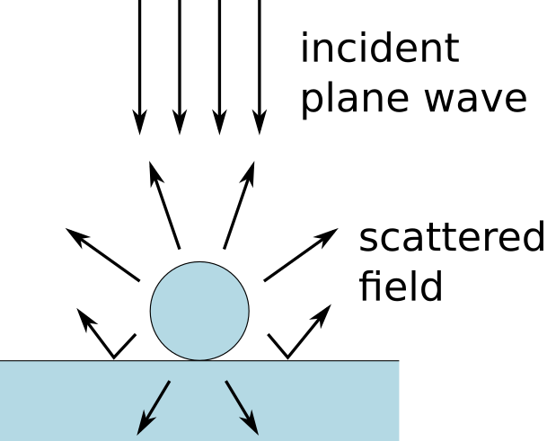

Sphere on a substrate
=======================

The "sphere on a substrate" is a minimal Smuthi simulation. 
It investigates scattering by a single glass sphere on a glass substrate and evaluates the total scattering cross section.

Click :download:`here <../../../examples/tutorials/01_sphere_on_substrate/dielectric_sphere_on_substrate.py>` 
to download the Python script.

The simulation output is the total scattering cross section of the sphere.

.. image:: console_screenshot.png
   :width: 75%

   