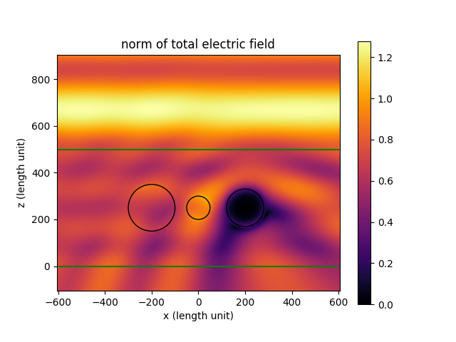
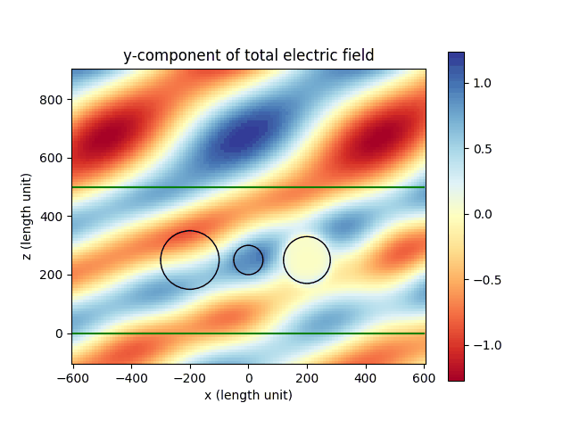

Plotting the near field
=======================

This example contains the simulation of a plane wave scattered by three polydisperse spheres
embedded in a thin film on a glass substrate under air. Click :download:`here <../../../examples/tutorials/02_near_fields/plotting_the_field.py>` 
to download the Python script.

After the simulation has been run, the electric field distribution is evaluated in a post processing step.
Click on the following link to view the API documentation of the function that is used to calculate and plot the fields.
:py:func:`smuthi.postprocessing.graphical_output.show_near_field`

The left sphere is made from a dielectric material, the middle sphere is made from air, and the right sphere is made of metal.
In the resulting plots, we can see that the field inside the metal sphere is close to zero (as expected).

Some notes regarding run time
-----------------------------

The evaluation of the electric field can take a considerable time. With the following measures, you can reduce the run time of electric field evaluations:

- Use a graphics card. If you have an NVIDIA gpu available (doesn't need to be a fancy one), you can speedup calculations considerably. 
  See the installation diretions for :ref:`GPUAnchor`

- Play with the resolution of the plots. You can also use interpolation to produce plots with a smooth appearance even if the fields
  were evaluated on a coarse grid. However, be cautions as this can evoke the false impression of a finely resolved simulation result!

- Reduce the sampling of the `k_parallel` and `azimuthal_angles` arrays used for the plane wave expansions of the fields (to do: more explanation)
   
