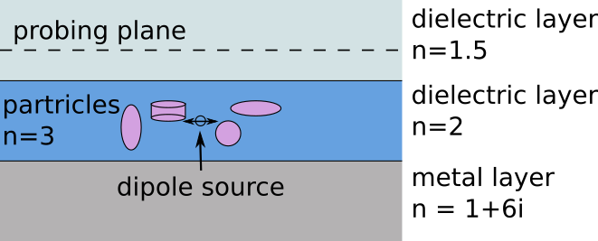
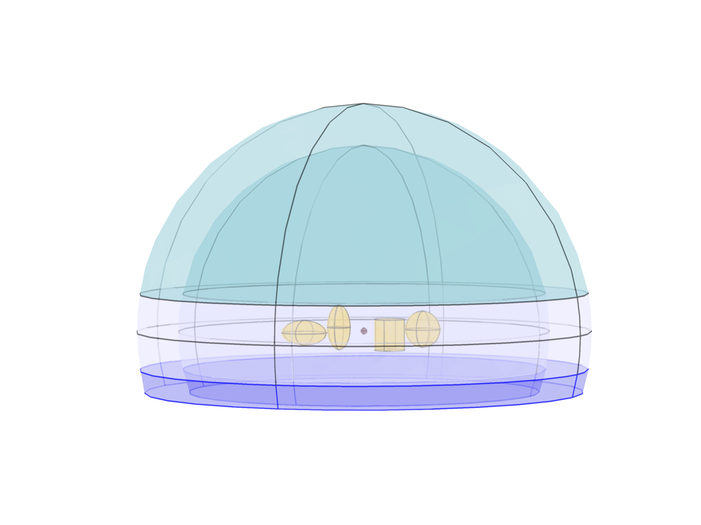
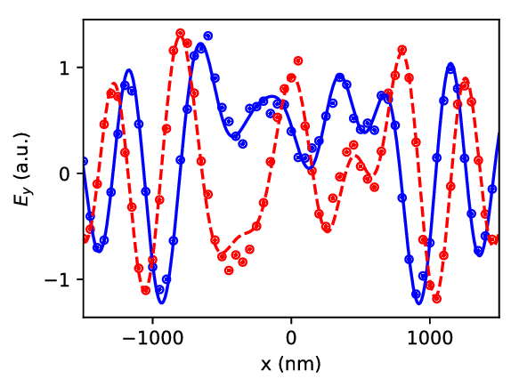
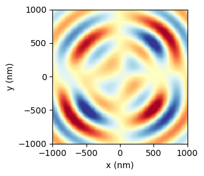
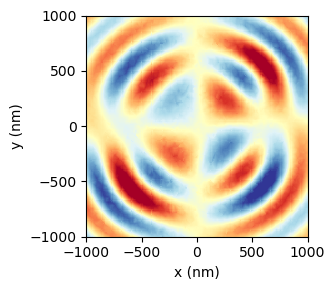
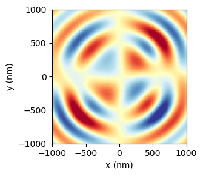

Four particles in a slab waveguide
==================================

In this benchmark, the electric field of a horizontal dipole source emitting
at from inside a planalry layered medium consisting of a metallic layer (n=1+6i), 
a high index dielectric layer (n=2, d=500nm) layer and another dielectric layer
(n=1.5).

The core layer includes four scattering particles with the shape of a
sphere, a prolate spheroid, an oblate spheroid and a finite cylinder.

The electric field is computed with Smuthi and compared to results from a 
Comsol FEM simulation (see a snapshot of the Comsol model to the right).

The below plot compares the Smuthi results to the Comsol results along a 
probing line through the core layer.

   
The agreement between Smuthi (lines) and Comsol (symbols) is good, both for the
real part(blue) and the imaginary part (red) of the field. We have reason to 
believe that it is not constrained by Smuthi's accuracy, but rather by the 
accuracy of the FEM results which show fluctuations in a similar order of 
magnitude as the deviations between the results when varying the simulation 
volume size - possibly due to residual reflections from the "perfectly matched 
layers".   

In the following, the field along a probing plane through the top layer is 
compared. 

The left image shows :math:`\mathrm{Im}(\mathbf{E}_y)` field computed with 
Comsol, the right shows the field computed with Smuthi. The agreement is good.

The left image shows :math:`\mathrm{Re}(\mathbf{E}_y)` field computed with 
Comsol, the right shows the field computed with Smuthi. Again, the agreement is 
good.