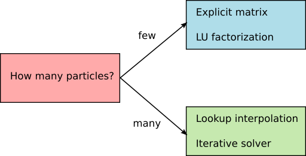

Simulating many particles
=========================

This tutorial demonstrates how to set up a simulation containing many particles.

How to compute large systems
----------------------------
In order to limit the runtime, Smuthi currently offers two numerical strategies for
the solution of the scattering problem:

   1. `LU factorization <https://en.wikipedia.org/wiki/LU_decomposition>`_, that is basically a variant of Gaussian elimination.
      To this end, the interaction matrix is fully stored in memory.

   2. Iterative solution with the `GMRES method <https://en.wikipedia.org/wiki/Generalized_minimal_residual_method>`_.
      In this case, you can either store the full interaction matrix in memory, or use a lookup from which
      the matrix entries are approximated by interpolation, see
      `Amos Egel's PhD thesis <https://publikationen.bibliothek.kit.edu/1000093961/26467128>`_ (section 3.10.1) or
      `[Egel, Kettlitz, Lemmer, 2016] <https://doi.org/10.1364/JOSAA.33.000698>`_

With growing particle number, all involved operations get more expensive, but the costs of LU factorization grow
faster than the cost of iterative solution. Similarly, costs of calculating of the full interaction matrix grows
faster than the cost of computing a lookup table. For this reason, we recommend the following decision scheme:

The numerical strategy for solving the linear system is defined through the input parameters of the
simulation constructor. The relevant parameters are:

- :code:`solver_type`: Either "LU" or "gmres"
- :code:`solver_tolerance`: This parameter defines the abort criterion.
  If the residual is smaller than the tolerance, the solver halts.
  The parameter is ignored in case of "LU" solver type.
- :code:`store_coupling_matrix`: If true, the coupling matrix is explicitly calculated and stored in memory.
  Otherwise, a lookup table is prepared and the matrix-vector multiplications are run on the fly, where the
  matrix entries are computed using the lookup table. The parameter is ignored in case of "LU" solver type.
- :code:`coupling_matrix_lookup_resolution`: If lookup tables should be used, this needs to be set to a distance value
  that defines the spatial resolution of the lookup table. The parameter is ignored when the coupling matrix is
  explicitly calculated.
- :code:`coupling_matrix_interpolator_kind`: If lookup tables should be used, define here either "linear" or "cubic"
  interpolation. "linear" is faster and "cubic" is more precise for the same resolution. The parameter is ignored when the coupling matrix is
  explicitly calculated.

This would be a typical setting for a **small number of particles**::

   simulation = smuthi.simulation.Simulation( ...
                                             solver_type='LU',
                                             store_coupling_matrix=True,
                                             ... )

This would be a typical setting for a **large number of particles**::

   simulation = smuthi.simulation.Simulation( ...
                                             solver_type='gmres',
                                             solver_tolerance=1e-4,
                                             store_coupling_matrix=False,
                                             coupling_matrix_lookup_resolution=5,
                                             coupling_matrix_interpolator_kind='linear',
                                             ... )

Note that GPU acceleration is currently only available for particle coupling through lookup interpolation.

Example: A spiral of spheres
----------------------------

The configuration under study consists of a number of monodisperse dielectric spheres that are
arranged in the shape of a spiral on a glass substrate. This configuration of particles is particularly
well suited for the lookup table strategy, because all particle centers are on the same height (z-position)
such that the interaction matrix can be calculated using a one-dimensional lookup table,
see section 3.10.1.2 of `Amos Egel's PhD thesis <https://publikationen.bibliothek.kit.edu/1000093961/26467128>`_.

.. image:: vogel_spiral_200.png
   :width: 45%

.. image:: drawing.png
   :width: 45%

The spheres are illuminated by a plane wave from top under normal incidence. The resulting differential far field distribution of the scattered field for a spiral of 200 spheres is depicted below,
both in the top hemisphere (reflection, left) and in the bottom hemisphere (transmission, right).

.. image:: dscs_200spheres_top.png
   :scale: 50%

.. image:: dscs_200spheres_bottom.png
   :scale: 50%

Let us discuss the runtime required by the solution of the scattering problem. In the
:download:`tutorial script <../../../examples/tutorials/many_spheres_on_substrate/many_dielectric_spheres_on_substrate.py>`,
we loop over the particle number and solve the scattering problem either with ...

   1. direct solution (LU factorization) and explicit calculation of the coupling matrix
   2. iterative solution and linear interpolation of 1D lookup table on the CPU
   3. iterative solution and linear interpolation of 1D lookup table on the GPU.

In either case we measure the time that the algorithm needs to set up and and solve the system of linear
equations.

.. image:: runtime.png
   :width: 75%
   :align: center

As the above figure illustrates, the direct solver is fastest for very small particle numbers (below ~10).
Linear interpolation from a lookup table in conjunction with the iterative solver runs much faster for
larger particle numbers. We can also see that the benefit from parallelization on the GPU starts to
overcompensate the time losses due to overhead from memory transfer starting from ~100 particles.

.. note::
   All numbers depend on the hardware that you use. In addition, it makes a huge difference for the
   CPU runtimes if numpy is configured to use all kernels of your workstation or just one of them for heavy calculations on
   the CPU.

