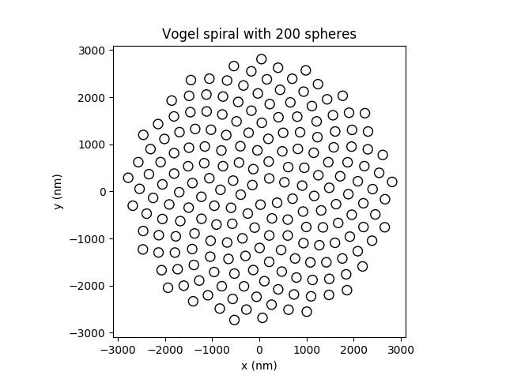
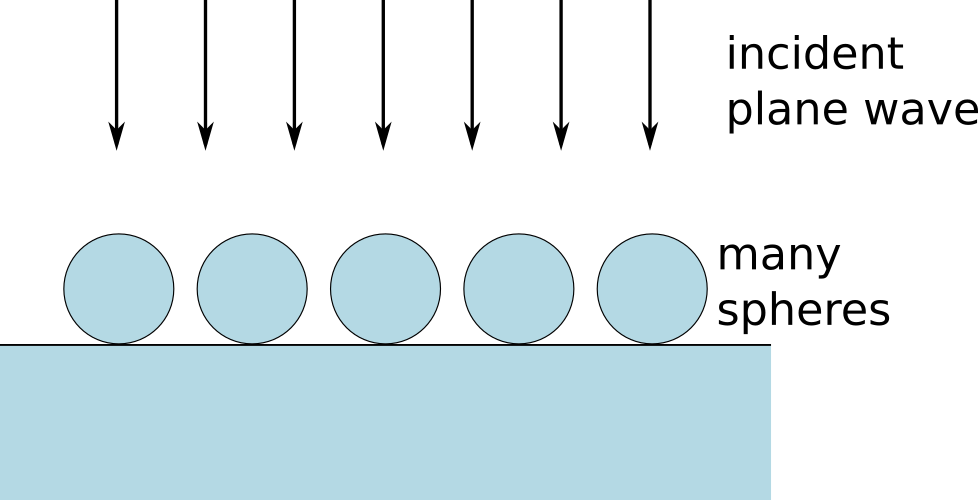
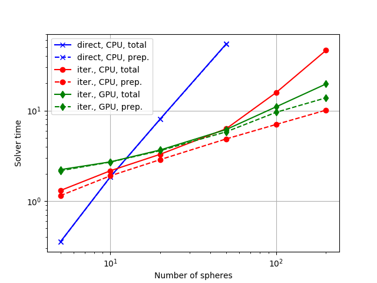
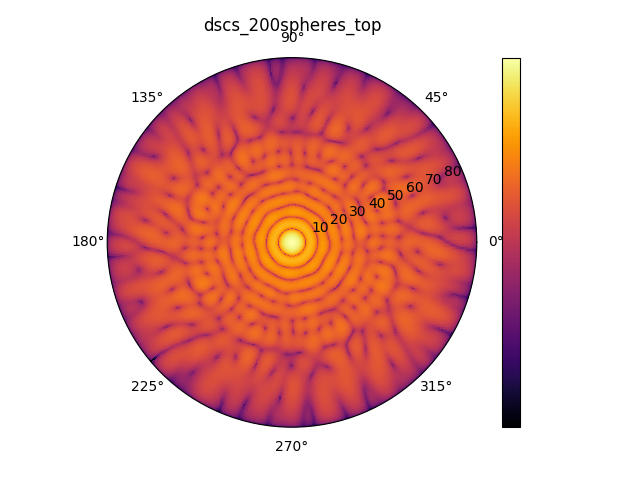
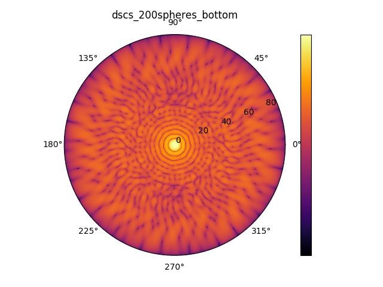

Many spheres on a substrate
===========================

This tutorial demonstrates how to set up a simulation containing many particles.

Configuration
-------------
The configuration under study consists of a number of dielectric spheres that are
arranged in the shape of a spiral on a glass substrate.

The spheres are illuminated by a plane wave from top under normal incidence.

How to compute large systems
----------------------------
In order to limit the runtime, Smuthi offers various numerical strategies for
the solution of the scattering problem.

To do: complete the discussion

.. image:: cross_section.png
   :width: 75%
   :align: center

Exemplary far field results
---------------------------

The above images show the resulting differential scattering cross section for a spiral of 200 spheres in the top hemisphere
(reflection) and in the bottom hemisphere (transmission).

