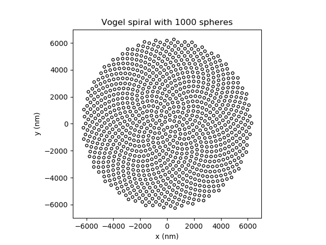

Many spheres on a substrate
===========================

This tutorial demonstrates how to set up a simulation containing many particles.
The configuration under study consists of a number of dielectric spheres that are
arranged in the shape of a spiral on a glass substrate.

The spheres are illuminated by a plane wave under normal incidence.

