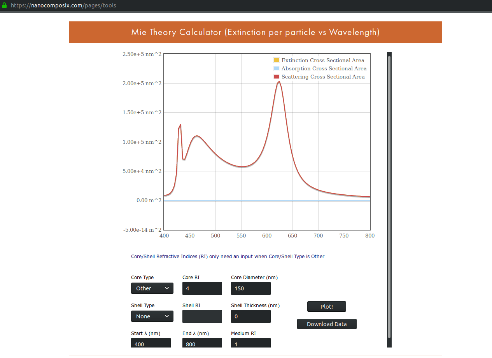
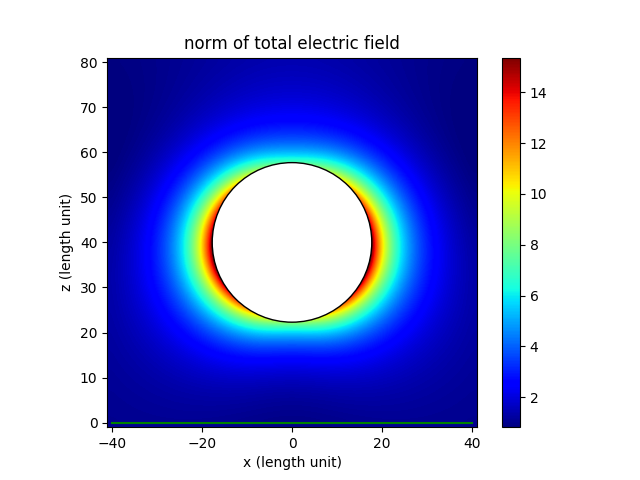
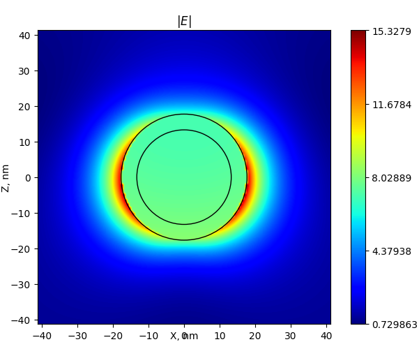
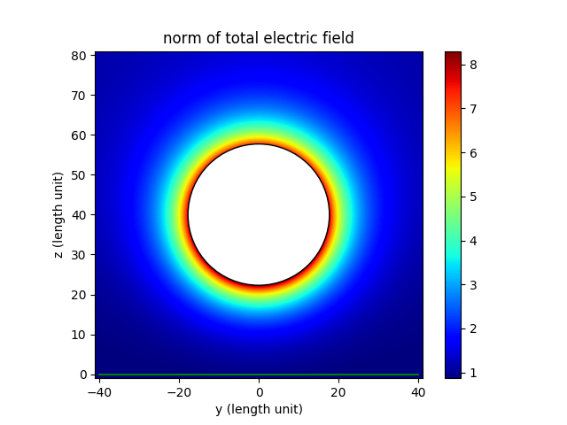
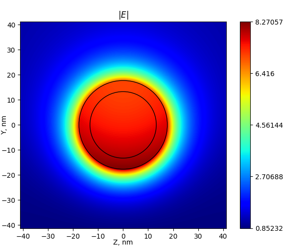

.. note:: This site is currently under construction.

Single sphere in vacuum
~~~~~~~~~~~~~~~~~~~~~~~~

Spectra
********

Comparison of spectra for a dielectric nanoparticle with :math:`r =
75` nm and :math:`n=4`. Spectra from Smuthi:

.. image:: ./Q_sca_spectra.png
   :scale: 70%
   :align: center

Spectra from `nanoComposix online Mie calculator
<https://nanocomposix.com/pages/tools>`_ :

Near-field
***********

Compare near-field plots for a silver nanoparticle. :math:`\lambda =
354` nm, :math:`r = \lambda/20.0`, and :math:`\varepsilon_{Ag} =
-2.0 + 0.28i`

Cross-section for polarization plane. Smuthi:

Scattnlay:

Cross-section perpendicular to polarization plane. Smuthi:
      

Scattnlay:

