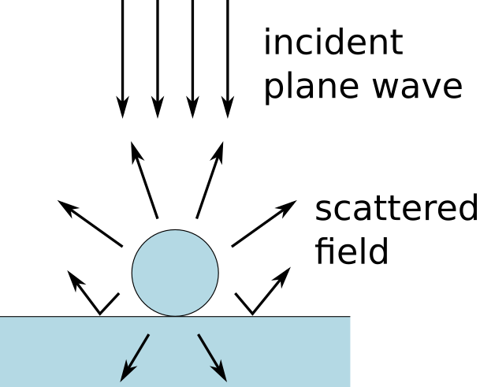
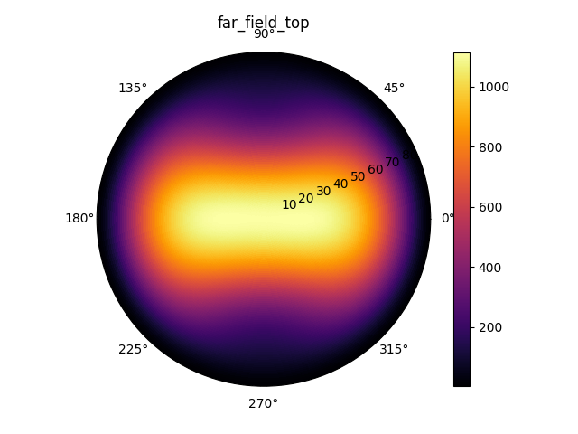
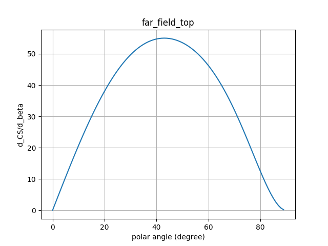
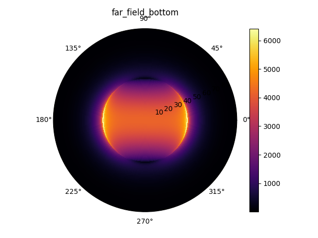
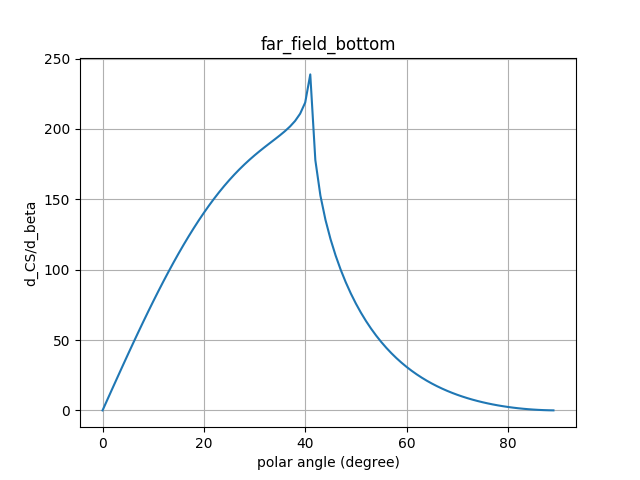

Sphere on a substrate
=======================

The "sphere on a substrate" example is a minimal example of how Smuthi can be
used. It simulates a single glass sphere on a glass substrate.

The simulation output is given by the top (i.e., air) and bottom (i.e., substrate)
scattered far field in the form of a differential scattering cross section.
The generated images should look like the following:

   
The above images show the 
`differential scattering cross section <https://en.wikipedia.org/wiki/Cross_section_(physics)#Differential_cross_section>`_ 
as a function of solid angle as a 2D polar plot (left) 
and the azimuthally integrated differential scattering cross section as a 
function of the polar angle only:

.. math:: \frac{\mathrm{d}C_\mathrm{scat}}{\mathrm{d} \beta} = \int_0^{2\pi}\frac{\mathrm{d}C_\mathrm{scat}}{\mathrm{d} \Omega} \sin \beta \mathrm{d}\alpha,

where :math:`(\beta, \alpha)` are the polar and azimuthal angle and   
:math:`\mathrm{d}C_\mathrm{scat}/\mathrm{d} \Omega` is the differential 
scattering cross section.
   

   
In the above images which correspond to the scattered signal in the bottom half
space (the substrate), one can see a sharp feature at the 
`critical angle <https://en.wikipedia.org/wiki/Total_internal_reflection#Critical_angle>`_
of the glass/air interface.   
