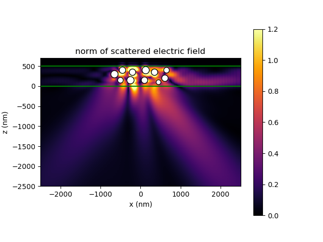
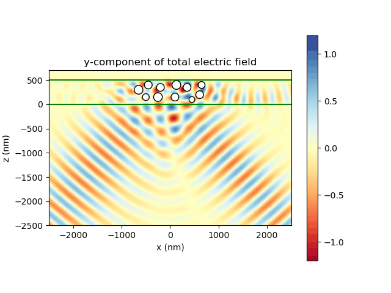
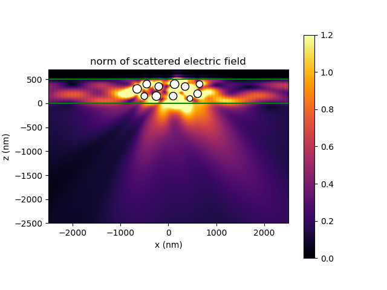
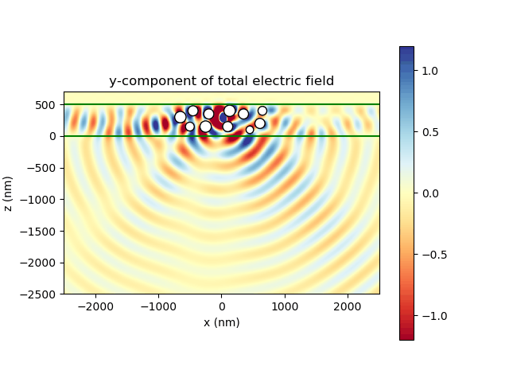

Gallery
==========

.. note:: This site is currently under construction.

This site contains some images generated with Smuthi.

The above images show an oblique Gaussian beam hitting a layer with particles under a reflective metal layer. The left
image shows the norm of the scattered field, whereas the right image shows an animation of the y-component of the total
field. One can see how the scattering couples some of the light into waveguide modes.

These images show the field from a dipole source between a collection of scattering particles. Again, the left shows the
norm of the scattered field, whereas the right shows an animation of the y-component of the total field.