Examples
==========

.. note:: This site is currently under construction.

Tutorials
----------

This section contains a number of exemplary simulation scripts to illustrate the use of Smuthi.

Dielectric sphere on a substrate
~~~~~~~~~~~~~~~~~~~~~~~~~~~~~~~~~
Click :download:`here <../scripts/tutorials/dielectric_sphere_on_substrate.py>` to download a very easy
example script that computes the differential scattering cross section of a glass sphere on a glass substrate.

.. todo:: illustration, input file

Dielectric sphere on a substrate: TIR microscopy
~~~~~~~~~~~~~~~~~~~~~~~~~~~~~~~~~~~~~~~~~~~~~~~~~~
.. todo:: provide example script that studies the scattering signal as a function of the particle/substrate distance

Two metallic spheres on a substrate: Purcell effect
~~~~~~~~~~~~~~~~~~~~~~~~~~~~~~~~~~~~~~~~~~~~~~~~~~~~
.. todo:: provide example script and input file for two spheres on a substrate and evaluation of Purcell effect

Dielectric metalens
~~~~~~~~~~~~~~~~~~~~
.. todo:: metalens example

Light extraction from a slab waveguide
~~~~~~~~~~~~~~~~~~~~~~~~~~~~~~~~~~~~~~~~
.. todo:: example with many spherical scatterers, also discussing CUDA speedup

.. todo:: provide at least one example that illustrates the influence of lmax and the contour parameters on the accuracy. 

Comparison to other codes
--------------------------

This section contains a number of benchmarks between Smuthi and other codes with regard to accuracy and runtime. 

Single sphere in vacuum
~~~~~~~~~~~~~~~~~~~~~~~~

Spectra
********

Comparison of spectra for a dielectric nanoparticle with :math:`r =
75` nm and :math:`n=4`. Spectra from Smuthi:

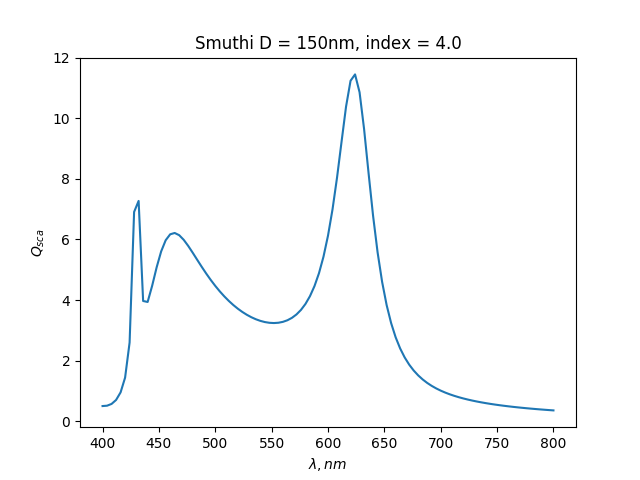

Spectra from `nanoComposix online Mie calculator
<https://nanocomposix.com/pages/tools>`_ :

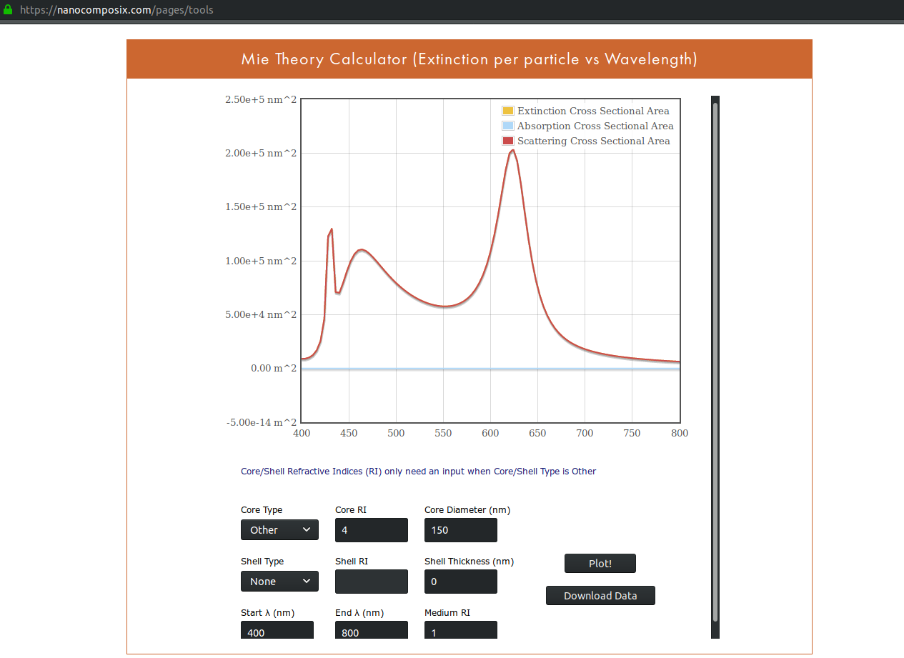

Near-field
***********

Compare near-field plots for a silver nanoparticle. :math:`\lambda =
354` nm, :math:`r = \lambda/20.0`, and :math:`\varepsilon_{Ag} =
-2.0 + 0.28i`

Cross-section for polarization plane. Smuthi:

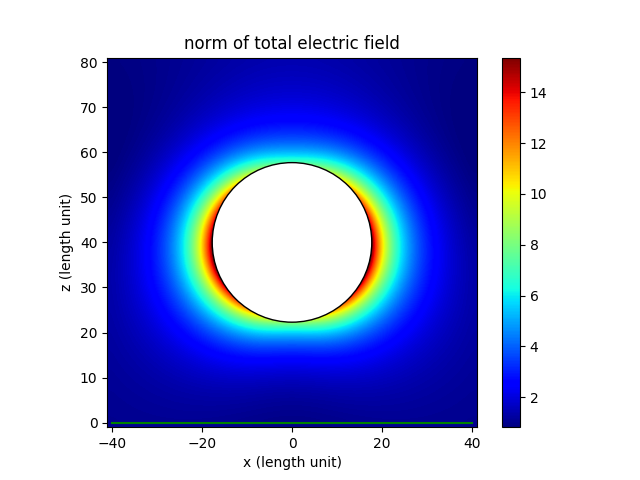

Scattnlay:

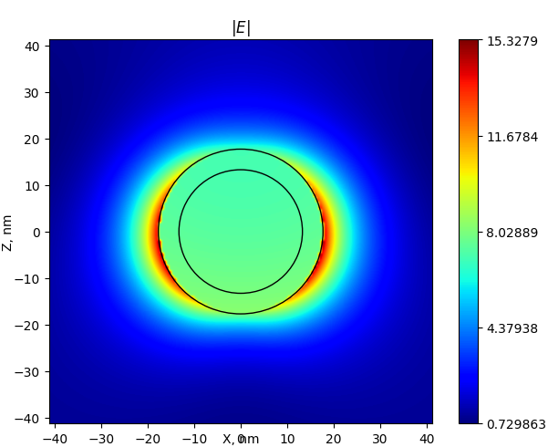

Cross-section perpendicular to polarization plane. Smuthi:
      
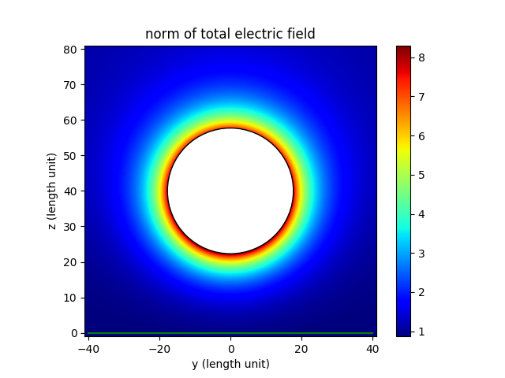

Scattnlay:

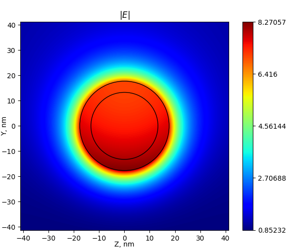

Four particles in a slab waveguide
~~~~~~~~~~~~~~~~~~~~~~~~~~~~~~~~~~~~
.. todo:: include cross check from dissertation

Gallery
----------

This section contains beautiful images generated with Smuthi.

  
Other examples (To do) 
-------------------------

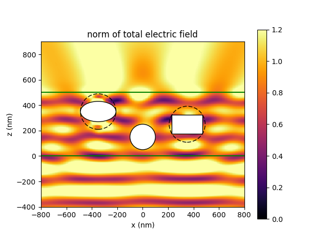

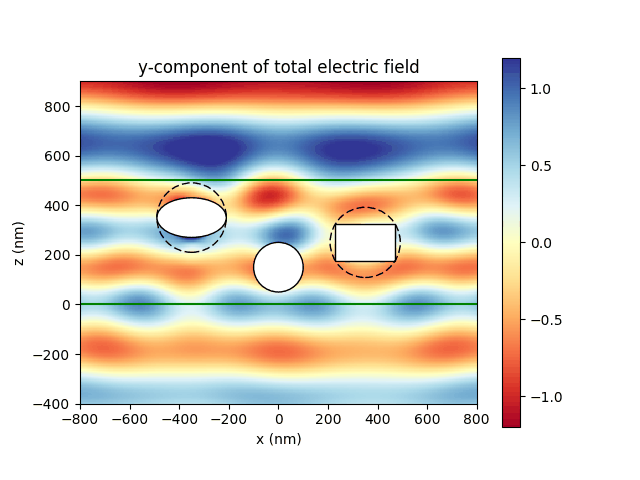

In the above example, the initial field is given by a
plane wave incident from below.

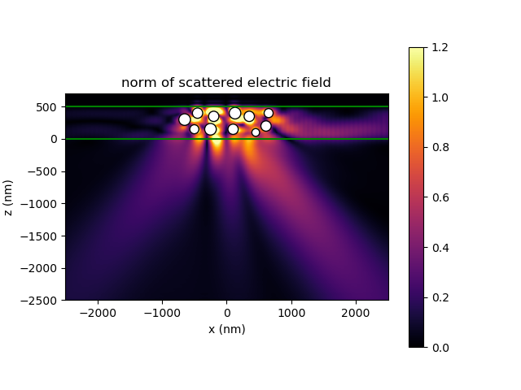

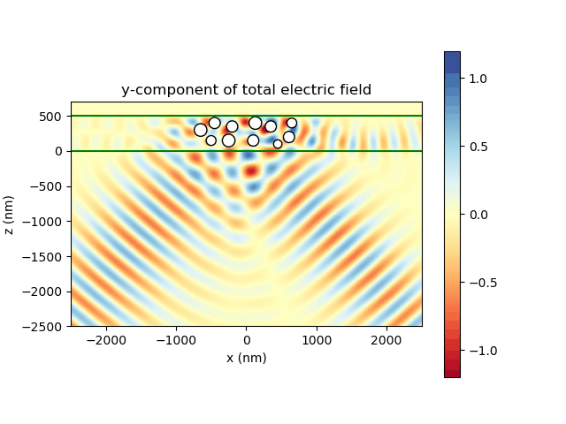

The above images show an oblique Gaussian beam hitting a layer with particles under a reflective metal layer. The left
image shows the norm of the scattered field, whereas the right image shows an animation of the y-component of the total
field. One can see how the scattering couples some of the light into waveguide modes.

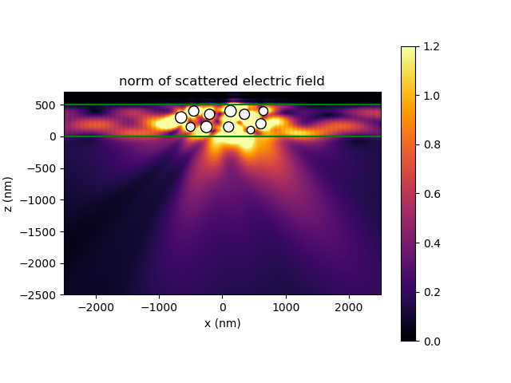

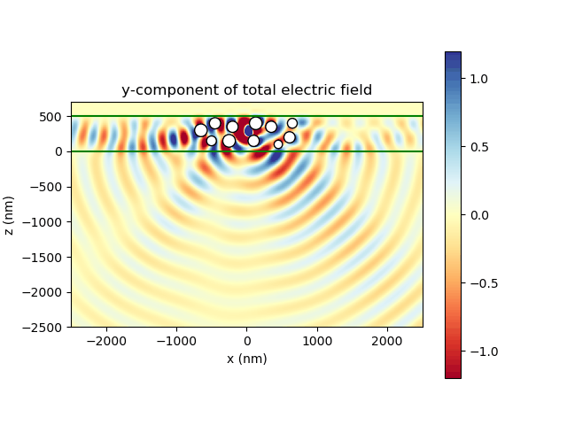

These images show the field from a dipole source between a collection of scattering particles. Again, the left shows the
norm of the scattered field, whereas the right shows an animation of the y-component of the total field.

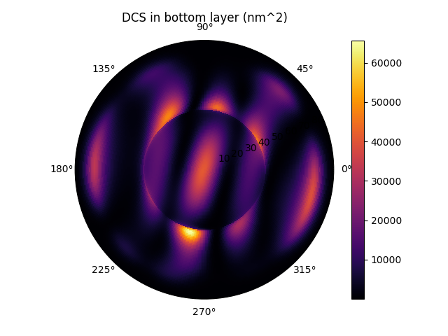

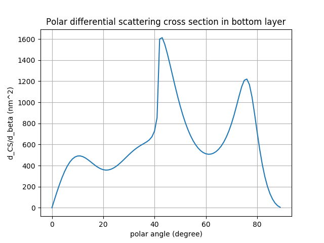

The above images show the 2D differential cross section in the bottom layer of the same simulation to which also the
first near field images above belong. The cross section is displayed as a polar plot (left) and its azimuthal integral
as a function of the polar angle only (right),

.. math:: \mathrm{DCS}_\mathrm{polar}(\beta) = \int \mathrm{d} \alpha \, \sin\beta \, \mathrm{DCS}(\beta, \alpha)

where :math:`(\alpha,\beta)` are the azimuthal and polar angle, respectively.

The sharp feature around 40° in the example relates to total internal reflection at the interface between media 2 and 3.

