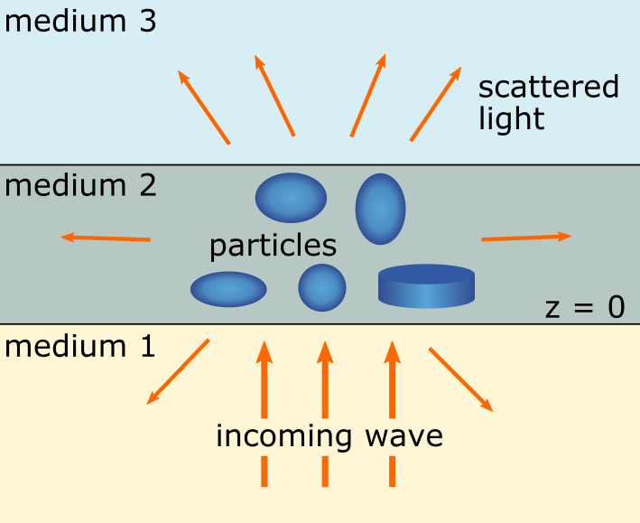
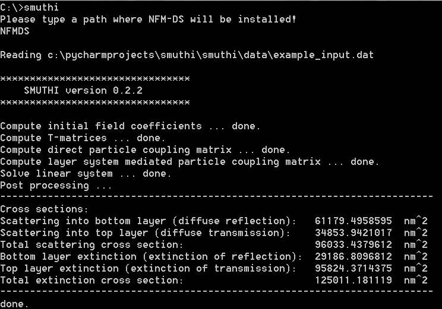

.. SMUTHI documentation master file, created by
   sphinx-quickstart on Wed May  3 19:50:09 2017.
   You can adapt this file completely to your liking, but it should at least
   contain the root `toctree` directive.

.. toctree::
   :maxdepth: 2
   
Welcome to SMUTHI's documentation!
==================================
SMUTHI stands for 'scattering by multiple particles in thin-film systems'.
The software allows you to solve light scattering problems involving
one ore multiple particles near or inside a system of planar layer interfaces.

It is based on the T-matrix method for the single particle scattering,
and on the scattering-matrix method for the propagation through the layered medium.

SMUTHI ...

 - ... exactly solves Maxwell's equations (3D wave optics) in frequency domain (one wavelength per simulation).
 - ... allows for the simulation of an arbitrary number of spheres and spheroids. For spheres, the T-matrix is given by the Mie-coefficients. For
   spheroids, SMUTHI calls the `NFM-DS <https://scattport.org/index.php/programs-menu/t-matrix-codes-menu/239-nfm-ds>`_,
   a Fortran software package written by A. Doicu, T. Wriedt and Y. Eremin, based on the "Null-field method with
   discrete sources".
 - ... returns the total and differential scattering cross section as well as the extinction cross section.
   The difference between scattering and extinction cross section refers to absorption (and incoupling to waveguide
   modes).

.. image:: far_field_output.png
   :scale: 80 %
   :align: center

Installing SMUTHI
===================
First make sure that Python 3 is installed on your computer. On Linux, this is usually the case. Windows users can use
for example `Anaconda <https://www.continuum.io/downloads>`_ or `WinPython <https://winpython.github.io/>`_ to get a
full python environment. Using pip, you can then install SMUTHI simply by (Windows)::

    pip install smuthi

Depending on where pip will install the package, you might need administrator rights for that. Under (Ubuntu), type::

   sudo pip3 install smuthi

Alternatively, you can download the SMUTHI project folder manually from `here <https://gitlab.com/AmosEgel/smuthi/tags>`_.
Open a command prompt and change directory to the SMUTHI project folder. Then, enter (Windows)::

   python setup.py install

or (Ubuntu)::

   sudo python3 setup.py install

When you run a simulation (containing non-spherical particles) for the first time after installation, you will be asked
to enter a path where SMUTHI will install the NFM-DS Fortran package. This automatically created folder should not be
removed or modified afterwards. Otherwise, the simulation of non-spherical particles becomes impossible and you might
need to re-install SMUTHI.

Running a simulation
======================
There are two different ways to call smuthi:

   * From the command line with an input file. No programming skills are required. 
	 
   * From a Python script. This option is more flexible regarding how to run and evaluate the simulations.
     
Run from command line
---------------------

SMUTHI is executed from the command line together with one argument,
specifying the input file that contains all parameters of the configuration to be simulated.

To execute SMUTHI, open a command window (shell or Win Python Command Prompt) and type::

   smuthi path/to/input.dat

If :code:`smuthi` is called without an argument, it uses an
:download:`example_input.dat <../smuthi/data/example_input.dat>`. The output should look like this:

The input file
~~~~~~~~~~~~~~~
The input file uses the `YAML <http://yaml.org/>`_ format.
Download an example file :download:`example_input.dat <../smuthi/data/example_input.dat>` and play around with its
entries to get a quick start.

For a detailed explanation of the specified parameters, see the :doc:`section on input files <input_files>`.

Running simulations as Python scripts
---------------------------------------
In the SMUTHI project folder, you find a script called :download:`run_smuthi_as_script.py <../run_smuthi_as_script.py>`.
You can also download it from here by clicking on the above filename.

Edit and run that script to get a quick start.
For details, see the :doc:`section on running SMUTHI from scripts <smuthi_from_scripts>`.

