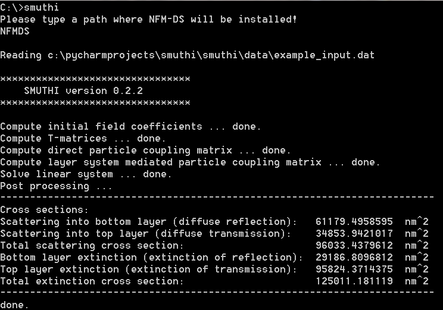

Running a simulation
======================
There are two different ways to call smuthi:

   * From the command line with an input file. No programming skills are required.

   * From a Python script. This option is more flexible regarding how to run and evaluate the simulations.

Run from command line
---------------------

SMUTHI is executed from the command line together with one argument,
specifying the input file that contains all parameters of the configuration to be simulated.

To execute SMUTHI, open a command window (shell or Win Python Command Prompt) and type::

   smuthi path/to/input.dat

If :code:`smuthi` is called without an argument, it uses an
:download:`example_input.dat <../smuthi/data/example_input.dat>`. The output should look like this:

The input file
~~~~~~~~~~~~~~~
The input file uses the `YAML <http://yaml.org/>`_ format.
Download an example file :download:`example_input.dat <../smuthi/data/example_input.dat>` and play around with its
entries to get a quick start.

For a detailed explanation of the specified parameters, see the :doc:`section on input files <input_files>`.

Running simulations as Python scripts
---------------------------------------
In the SMUTHI project folder, you find a script called :download:`run_smuthi_as_script.py <../run_smuthi_as_script.py>`.
You can also download it from here by clicking on the above filename.

Edit and run that script to get a quick start.
For details, see the :doc:`section on running SMUTHI from scripts <smuthi_from_scripts>`.